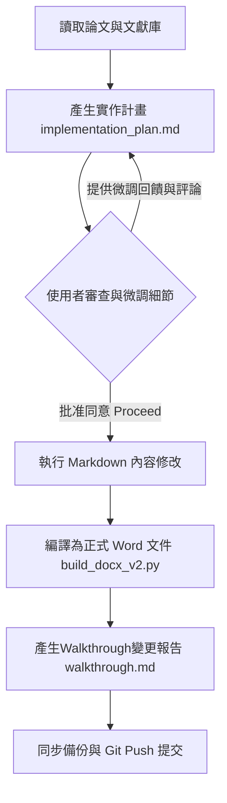

# 2026-06-17 Frontiers Review Paper Antigravity 學習筆記

這是一份記錄使用 **Antigravity 2.0** 協同執行學術論文審查（Manuscript ID: 1878469）的學習筆記。本篇筆記詳述了如何透過 Antigravity 2.0 的雙環協作機制，高效且精確地完成複雜的學術論文評審任務，並將此流程封裝為可重複使用的專業技能庫（Skill）。

---

## 1. 核心流程概述與環境配置

本次學術論文審查流程起源於 `2026Cordex` 儲存庫中的 `peer-review-cross-ref` 技能。為執行此任務，在本地環境中規劃並建立了以下兩個核心目錄：

### E 槽：文獻對照庫 (Literature Reference Library)
- **路徑**: `E:\Frontiers_Aging_Neuroscience_Review_Lit\`
- **功能**: 存放分類整理的 PDF 文獻（例如：PAF/IAPF, 功率譜分佈, Aperiodic 1/f, 機器學習與 AD 等子資料夾），用作與投稿論文 claim 進行交叉比對的核心事實來源。
- **管理文件**:
  - `INDEX.md`: 文獻索引指引。
  - `Analysis_Report.md`: 本地文獻與投稿論文觀點的比對分析報告。

### D 槽：審查工作區 (Working Review Workspace)
- **路徑**: `D:\Frontiers in Aging Neuroscience Paper review\`
- **功能**: 存放待審查的投稿論文（`1878469_Manuscript.PDF`）、正在修訂的審查意見草稿（`Reviewer_Comments_2026-06-10.md`）以及格式編譯腳本（`build_docx_v2.py`）。
- **最終產出**: `Reviewer_Comments_2026-06-17.docx`（編譯產出的 Word 報告）。

---

## 2. Antigravity 2.0 雙環協同開發模型

本流程的核心優勢在於採用了 Antigravity 2.0 的**實作計畫 (Implementation Plan) ⇄ 執行驗證 (Walkthrough)** 雙環迭代機制。

### 第一環：計畫與微調階段 (Implementation Plan Loop)
1. **生成計畫**: Antigravity 首先會針對使用者提出的修正目標，在 workspace 內建立 `implementation_plan.md`，詳列預計修改的條目、使用的科學論據、擬新增的文獻，以及可能面臨的架構決策。
2. **使用者微調 (Comments in Plan)**: 使用者直接在實作計畫中加入評論或要求微調（例如：移除冗餘的 `**Why it matters:**` 副標題、調整文獻選用、指明特定的頁碼與行號）。
3. **無損回饋**: Antigravity 在收到微調意見後，會重新精確計算並更新實作計畫，直至使用者批准（Proceed）。

### 第二環：執行與驗證階段 (Walkthrough Loop)
1. **精密執行**: 批准後，Antigravity 將 Markdown 形式的評審草稿修訂完畢。
2. **腳本編譯**: 運行 `python build_docx_v2.py`，將 Markdown 格式的評審意見編譯為美觀排版的正式 Word 文件 (`Reviewer_Comments_2026-06-17.docx`)。
3. **Walkthrough 報告**: 修訂完成後，Antigravity 自動生成 `walkthrough.md`，詳述本次修改的所有變更點（包含如何解決 `Al Zoubi (2018)` 與 `Hembara & Vakorin (2023)` 重複計數與引用的科學衛生問題）、編譯結果及文件路徑。這能讓使用者一眼掌握微調後的最終呈現，極具精確性與效率。

---

## 3. 科學評審核心知能整理

在對 Manuscript 1878469 進行審查的過程中，針對以下 aging neuroscience 關鍵爭議點進行了深度文獻考證與論述強化：

### 3.1 Delta/Theta 頻帶：健康老化 vs. 病理性 AD 腦波慢化
*   **健康生理老化 (Physiological Aging)**: 絕對 Delta 與 Theta 頻帶功率**不會增加**（通常呈持平或下降趨勢）。雖然 PAF (後部優勢節律 Alpha) 會有所減慢，但其慢波功率不會反向升高（Voytek et al., 2015）。
*   **病理性阿茲海默症 (Pathological AD/MCI)**: 出現明顯且進行性的「EEG 慢化 (EEG slowing)」，絕對 Delta/Theta 功率顯著升高，優勢節律完全向低頻位移。
*   **生理機制**: 膽鹼能基底前腦退化（部分可由 AChEIs 藥物或 memantine 減緩；Babiloni et al., 2013） $\rightarrow$ 神經元興奮與抑制 (E/I) 失衡（Maestu et al., 2021） $\rightarrow$ 皮質網路中斷與異常同步化（Lopez et al., 2014） $\rightarrow$ 慢波功率病理性上升。
*   **臨床意義**: BrainAGE (腦年齡) 機器學習預測模型必須嚴格區分此二者的相反軌跡，避免將正常的低頻功率衰減與 AD 的慢波異常增強混淆。

### 3.2 1/f Aperiodic Component (非週期性指數) 於 AD 的科學爭議
論文中若僅描述 1/f exponent 變化而未提及學界爭議，將缺乏嚴謹度。學界目前對 AD 患者的 Exponent 變化有三種主要立場：
1.  **立場 A (Exponent 增加 / 變陡)**: 以 **Chu et al. (2023, *Frontiers in Aging Neuroscience*)** 為代表。研究在嚴格年齡控制下，顯示 AD 患者 Exponent 從 CN (~1.0) 顯著升高至重度 AD (~1.5)，反映出大腦為了抑制過度興奮而產生的補償性**抑制主導 (Inhibitory Dominance)** 機制（Gao et al., 2017）。
2.  **立場 B (Exponent 減少 / 變平)**: 符合加速老化假說（Voytek et al., 2015; Finley et al., 2023），認為 Exponent 下降與認知功能退化呈正相關。
3.  **立場 C (無顯著差異)**: 以 **Kopcanova et al. (2024, *Neurobiology of Disease*)** 為代表，主張在精確剔除 periodic (週期性) 震盪後，AD 的電生理改變主要存在於週期性成分，非週期性成分並無顯著差異。

#### Donoghue (2024) 系統性回顧文獻解析
*   **文獻**: *Donoghue et al. (2024, A systematic review of aperiodic neural activity in clinical investigations)*.
*   **核心數據**: 回顧 143 篇研究 (涵蓋 35 種疾病)，其中非週期性指數變化分布為：35% 增加（變陡）、31% 減少（變平）、30% 無顯著差異。
*   **AD 專門分析 (9 篇報告)**: 結果被歸類為**不一致 (Inconsistent)**（8 篇報告指數增加/變陡，3 篇報告減少/變平，且具有腦區特異性）。
*   **方法學差異原因**:
    1.  *FOOOF/specparam 參數設定不一*: 僅 56% 報告完整參數設定，僅 30% 報告擬合度 $R^2$。
    2.  *擬合頻率範圍差異*: 例如採用 1–43 Hz 與 3–30 Hz 估算出的 Exponent 會有系統性偏差。
    3.  *受試者疾病嚴重度*: Chu et al. (2023) 納入了重度 AD 患者，而 Kopcanova et al. (2024) 則以輕中度為主。
    4.  *共變量控制*: 是否使用年齡作為共變量（ANCOVA）或進行精確年齡匹配，會極大影響分析結果。

### 3.3 機器學習框架分類與文獻交叉比對
審查中特別針對 Section 3.2 機器學習腦年齡預測框架進行分類界定：
*   **傳統機器學習 (Feature-based ML)**: 手動提取 PSD、Complexity 等特徵後輸入機器學習模型（如 Al Zoubi et al., 2018）。
*   **端到端深度學習 (End-to-End DL)**: 直接以 raw EEG 輸入 CNN/RNN 進行黑盒子式預測。
*   **文獻衛生審查**: 糾正了將 **Hembara & Vakorin (2023)** 當作獨立實證研究的錯誤。該文實際上僅是一篇研究協議（Protocol），其所列的 MAE 6.9 年與 $R^2 = 0.37$ 的數據完全是引用自 **Al Zoubi et al. (2018)**，若不指出將導致嚴重的重複計數與文獻誤導問題。

---

## 4. 打包儲存與版本控制 (Git)

為了讓此成果能永續留存並隨時調閱，這套方法論已完成以下儲存與同步：

1.  **Frontiers Review Paper Skill (peer-review-cross-ref v2)**:
    *   主技能檔已寫入 `E:\Frontiers_Aging_Neuroscience_Review_Lit\_tmp_2026Cordex\skills\peer-review-cross-ref\SKILL.md`。
    *   備份副本儲存於 `C:\Users\User\2026Antigravity\Frontiers_paper_review_SKILL.md`。
    *   備份副本儲存於雲端 `G:\我的雲端硬碟\Second Brain\知識庫\2026 Antigravity 備份\Frontiers_paper_review_SKILL.md`。
2.  **Antigravity 學習筆記**:
    *   本學習筆記檔案儲存於 `C:\Users\User\2026Antigravity\2026-06-17 Frontiers Review Paper Antigravity 學習筆記.md`。
    *   備份副本儲存於雲端 `G:\我的雲端硬碟\Second Brain\知識庫\2026 Antigravity 備份\2026-06-17 Frontiers Review Paper Antigravity 學習筆記.md`。
3.  **Git 同步提交**:
    *   將 `C:\Users\User\2026Antigravity` 的修改與新增提交，推送至 [https://github.com/ckt520728/2026-Antigravity](https://github.com/ckt520728/2026-Antigravity)。
    *   將 `E:\Frontiers_Aging_Neuroscience_Review_Lit\_tmp_2026Cordex` 的技能升級提交，推送至 [https://github.com/ckt520728/2026Cordex](https://github.com/ckt520728/2026Cordex)。
