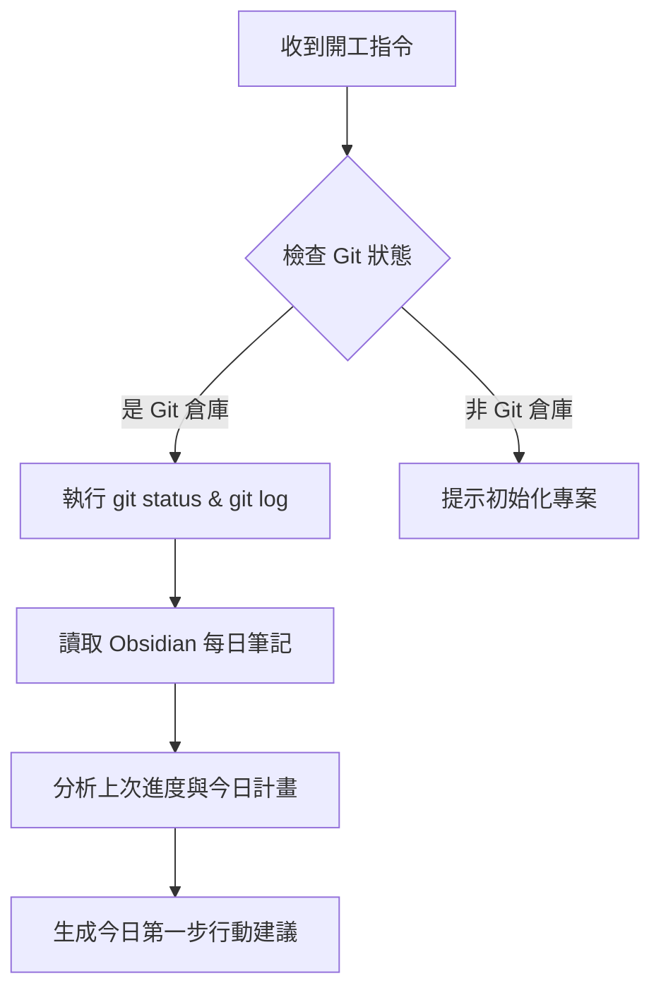

# 🛸 Anti-Gravity 專案自動化駕駛艙 (ANTIGRAVITY.md)

歡迎使用 **Anti-Gravity 2** 專案智慧控制台。本檔案定義了專案的「自動化 SOP 流程」，讓您能透過簡單的口令，驅動 AI 進行高效率的專案管理與筆記同步。

---

## 📊 專案基本設定 (Project Configuration)

| 設定項目 | 設定值 | 說明 |
| :--- | :--- | :--- |
| **專案名稱** | `2026Antigravity` | 當前開發專案目錄 |
| **版本控制** | Git (GitHub) | 管理代碼歷史與遠端同步 |
| **第二大腦** | Obsidian (`Second Brain`) | 存放每日筆記與專案進度 |
| **自動化中心** | Google NotebookLM | 知識庫來源與 AI 筆記管理 |

---

## 🟢 技能一：開工工作流 (SOP: Start Work)

當您對我說：🗣️ **「開工」** 或 **「我來了」** 時，我將自動執行以下步驟：

### 📋 執行細節：
1. **Git 狀態確認**：自動執行 `git status` 與 `git log -n 5`，評估當前分支是否落後或領先遠端，確保代碼版本為最新。
2. **第二大腦讀取**：定位至 Obsidian 的 `每日筆記/`，尋找最近一天的筆記，讀取「上次做到哪」與「下一步計畫」。
3. **今日行動指南**：彙整上述資訊，以條列式摘要呈現今日的最佳切入點，讓您一秒進入開發狀態。

---

## 🔴 技能二：收工工作流 (SOP: End Work)

當您對我說：🗣️ **「收工」** 或 **「下班了」** 時，我將自動執行以下步驟：

> [!WARNING]
> **安全防護第一：** 在上傳任何代碼前，我會進行敏感檔案掃描，防止 `.env` 或 API Keys 意外洩漏！

### 📋 執行細節：
1. **安全代碼掃描**：檢查是否有 API Key、密碼或未加入 `.gitignore` 的敏感檔案。
2. **自動 Git Commit & Push**：
   - 執行 `git add .`。
   - 根據今日的修改內容，自動為您草擬符合 Conventional Commits 規範的 Commit Message。
   - 獲得您確認後，自動執行 `git commit` 與 `git push` 到遠端。
3. **第二大腦進度更新**：
   - 自動在您的 Obsidian 每日筆記中寫入「本日已完成工作」與「留待明日待辦事項」，維持完美的日誌記錄。

---

## 🔵 技能三：初始化新專案 (SOP: Initialize Project)

當您對我說：🗣️ **「初始化專案」** 時，我將自動執行以下步驟：

### 📋 執行細節：
1. **基礎文件生成**：在根目錄自動建立此 `ANTIGRAVITY.md`、`.gitignore`（過濾 node_modules, .env 等）與 `README.md`。
2. **本地 Git 初始化**：執行 `git init`，加入所有初始檔案，並完成 `Initial commit`。
3. **遠端倉庫建立**：使用 GitHub CLI (`gh repo create`) 在您的 GitHub 上建立對應名稱的私有/公開倉庫，並自動將本地代碼推送上去。
4. **第二大腦同步**：直接在您的 Obsidian 筆記目錄中，為此新專案建立專屬的工作區資料夾，建立無縫的雙向連結。

---

## 🎨 資訊圖表與視覺輔助

需要生成專案簡報或教學圖表嗎？
* **語系規則**：我已預設以 **優雅的繁體中文** 作為生圖最高優先順序。
* **生圖指令範例**：
  > 🎯 *「請幫我以繁體中文生成一張『AI 代理人驅動自動化開發工作流』的五板塊玻璃擬態資訊圖表，並下載到目前資料夾。」*
