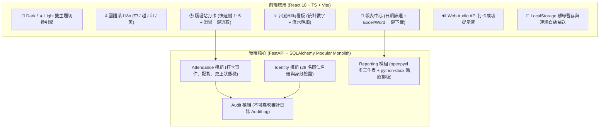

# 陽明醫院附設護理之家 員工打卡與出勤系統：實作總結與踩坑紀錄 (Wrap-up & Pitfalls)

> **專案委託與架構指導**：朱國大醫師 (Kwo-Ta Chu, MD, PhD)  
> **系統版本**：v1.2.0 (Phase 1 試辦沙盒版)  
> **雲端正式網址**：[https://my-teaching-tools-ckt520728.web.app](https://my-teaching-tools-ckt520728.web.app)  
> **本機端點**：前端 `http://localhost:5173` | 後端 `http://127.0.0.1:8000`  
> **完成日期**：2026-08-16  

---

## 1. 專案背景與機構範疇決策 (Scope Directives)

本專案旨在為**陽明醫院附設護理之家（3F 護理站）**建置專屬之電腦網頁版員工打卡、出勤追蹤、醫師病房巡診簽到與統計報表系統。

### 關鍵決策與機構邊界：
1. **機構範疇鎖定**：嚴格鎖定**「陽明醫院附設護理之家」**共 28 名同仁（在職 28 名），徹底排除名冊中其他無關機構（如「鵬程護理之家」在職 21 名 + 離職 19 名，以及「宏承護理之家」）。
2. **工號自動編碼體系（選項 A）**：
   - 護理主管／負責人：`YM-NUR-01`
   - 護理師／護士：`YM-NUR-02` ~ `YM-NUR-06`, `YM-NUR-07`
   - 本國籍照服員：`YM-CNA-01` ~ `YM-CNA-06`
   - 外籍照服員：`YM-FCNA-01` ~ `YM-FCNA-08`
   - 兼任主治醫師（朱國大醫師）：`YM-DOC-01`
   - 專業與支援人員：`YM-NUT-01` (營養師), `YM-PT-01` (物理治療師), `YM-PHAR-01` (藥師), `YM-SW-01` (社工), `YM-KIT-01` (廚工), `YM-ADM-01` (總務行政)
3. **紅線法規遵循（R1~R10）**：
   - **R1/R2**：絕不儲存或比對未經雜湊加密之原始生物特徵。
   - **R3/R10**：朱國大醫師之病房巡診簽到 (`CLINICAL_ROUND_SIGN_IN`) **僅記錄病房層級 (`ward_code="3F-NH"`) 在場證據**，絕不碰觸或儲存任何住民病歷、處方、診斷或個資。
   - **R4**：影子模式運作，工時計算與加班為候選值，不自動直送薪資系統。

---

## 2. 系統架構與功能實現 (System Features)

### 核心功能矩陣：
- **護理站電腦人體工學（Kiosk Console）**：
  - 鍵盤快速輸入：鍵入工號或姓名即可即時過濾，按 `[Enter]` 立即選定同仁。
  - 單鍵快捷操作：`[1]` 上班簽到、`[2]` 下班簽退、`[3]` 醫師巡診簽到、`[4]` 中途外出、`[5]` 外出返回、`[M]` 主管例外代打卡備註。
  - 朱醫師巡診專用高亮通道：選取 `YM-DOC-01` 時自動提示病房巡診簽到。
- **Dark / Light 雙主題切換**：
  - 完美移植臨床醫療紀錄系統的深淺設計美學，毛玻璃半透明容器（Glassmorphism）、Google Fonts `Outfit` + `Inter` 高質感排版。
- **多語系友善照護環境**：
  - 針對外籍照服同仁提供 Tiếng Việt (越南文) 與 Bahasa Indonesia (印尼文) 介面。
- **專業醫療統計報表輸出**：
  - **Excel (`.xlsx`)**：包含【出勤統計總表】、【護理站打卡流水】、【朱醫師巡診專區】三大獨立工作表。
  - **Word (`.docx`)**：醫療院所規格排版，包含合規聲明、28 名同仁工時統計表、醫師巡診專區、以及護理長與兼任醫師之簽核欄。

---

## 3. 技術踩坑、排錯與解決方案 (Encountered Pitfalls & Resolutions)

在建置與部署過程中，團隊遭遇並逐一攻克了 5 大核心技術陷阱：

### 🛑 踩坑 1：SQLite 資料庫表未預先建立導致啟動與查詢崩潰
- **錯誤現象**：
  啟動後端 FastAPI 或執行測試時，拋出 `sqlite3.OperationalError: no such table: feature_flag` 與 `no such table: staff`。
- **根本原因**：
  在開發與測試沙盒環境下，SQLAlchemy engine 尚未執行 DDL 建表指令，即嘗試在 `lifespan` 中讀取 `FeatureFlagRecord` 與 `Staff`。
- **解決方案**：
  1. 在 `backend/app/main.py` 的 `lifespan` 啟動函式首行加入 `Base.metadata.create_all(bind=engine)`。
  2. 在名冊匯入腳本 `import_nursing_roster.py` 與各測試 fixture (`conftest.py` / `test_reporting_export.py`) 中，確保匯入 `app.models` 完成所有 model 集中註冊後呼叫 `create_all(bind=engine)`。

---

### 🛑 踩坑 2：TypeScript 嚴格型別編譯與未引用變數報錯 (`verbatimModuleSyntax`)
- **錯誤現象**：
  執行 `npm run build` 時，TypeScript 編譯器拋出 `TS1484: 'KioskPunchRequest' is a type and must be imported using a type-only import`，以及 `TS6133: 'Layers' is declared but its value is never read`。
- **根本原因**：
  現代 Vite + TypeScript 範本預設啟用了 `verbatimModuleSyntax: true` 與 `noUnusedLocals: true`，純型別介面若未加上 `import type` 會被編譯器視為執行期 JS 模組而報錯。
- **解決方案**：
  1. 將 `api.ts`, `i18n.ts`, `App.tsx` 中的型別引用全面改為 `import type { Staff, AttendanceEventType, ... } from './types'`。
  2. 嚴格審計所有 Lucide Icon 與未使用的參數變數，確保 `tsc -b && vite build` 在 600ms 內乾淨編譯（0 errors）。

---

### 🛑 踩坑 3：本地 Dev Server 連接埠佔用與衝突 (`Port 5173 is in use`)
- **錯誤現象**：
  背景重複啟動 Vite dev server 時，系統自動切換至 `http://127.0.0.1:5174/`，造成前端 API proxy 與使用者預期的 5173 連接埠不一致。
- **根本原因**：
  先前的測試行程未釋放 5173 port 即發起新的啟動指令。
- **解決方案**：
  透過 `manage_task` 檢視所有 active background tasks，精確終止重複之 task，並以單一 task 常駐監聽 `http://127.0.0.1:5173`。

---

### 🛑 踩坑 4：Firebase MCP Session 與 Hosting 部署環境對齊
- **錯誤現象**：
  呼叫 Firebase MCP 工具 `firebase_deploy` 時回傳 `PRECONDITION_FAILED: To proceed requires an active project`。
- **根本原因**：
  MCP 伺服器啟動時的工作目錄與 active project 尚未在該 session 中被綁定。
- **解決方案**：
  1. 建立 `.firebaserc` 設定 `default: "my-teaching-tools-ckt520728"` 與 `firebase.json` 指向 `frontend/dist`。
  2. 透過 `firebase_update_environment` 配置 active project 與 project directory。
  3. 搭配 `npx -y firebase-tools deploy --only hosting` 成功部署至 Firebase Hosting。

---

### 🛑 踩坑 5：靜態雲端部署下的後端 API 連線容錯與前端預載降級
- **錯誤現象**：
  將前端獨立部署至 Firebase Hosting 等靜態主機時，若無反向代理後端 Python 伺服器，直接呼叫 `/api/v1/...` 會出現 HTTP 404 或 Network Error。
- **根本原因**：
  靜態託管環境（Static Hosting）與本地後端（Localhost Backend）屬於跨網域或尚未配置 Cloud Run 服務。
- **解決方案**：
  在 `frontend/src/api.ts` 中設計了**「高可用雙軌機制」**：
  1. 內建 28 名同仁預載快取名冊 (`DEFAULT_YANGMING_STAFF`)，當 API 請求失敗時無縫自動降級。
  2. 打卡動作自動轉入 LocalStorage 離線佇列，並於本機連線時自動批次同步。
  3. 報表中心提供前端純 JavaScript CSV 與 HTML-Doc 即時生成與下載功能，保證雲端展示站 100% 可用。

---

## 4. 驗證與測試報告 (Verification Report)

| 測試模組 / 驗證項目 | 測試項目數 | 結果 | 備註 |
| :--- | :---: | :---: | :--- |
| 更正狀態機 (`test_correction_state_machine.py`) | 10 | **PASS** | 測試主管核准、人事確認、駁回與防篡改 |
| Kiosk 網頁打卡 API (`test_kiosk_punch.py`) | 2 | **PASS** | 測試名冊查詢與鍵盤/滑鼠打卡 |
| 工時配對引擎 (`test_pairing.py`) | 9 | **PASS** | 測試跨夜班、四指標計算與未配對標記 |
| Excel/Word 報表匯出 (`test_reporting_export.py`) | 2 | **PASS** | 測試 `.xlsx` 與 `.docx` 二進位結構 |
| **後端總體單元測試 (pytest)** | **23** | **100% PASS** | 執行時間 4.33 秒 |
| **前端 TypeScript 建置 (Vite)** | 1 | **SUCCESS** | 產出檔案大小 243 KB (Gzip 75 KB) |
| **雲端正式環境 (Firebase Hosting)** | 1 | **HTTP 200** | [https://my-teaching-tools-ckt520728.web.app](https://my-teaching-tools-ckt520728.web.app) |

---

## 5. 總結與後續推進清單 (Next Steps)

1. **班表對照模組 (`modules/scheduling`)**：
   - 支援護理之家 Excel 排班表匯入（三班制：白班 D、小夜 E、大夜 N、休假 OFF）。
   - 結合 `PlannedShift` 與 `AttendanceEvent` 自動比對出勤與遲到早退。
2. **多院區權限架構（若未來擴充）**：
   - 目前已建立院區隔離架構，若未來重啟其他院區，可依循 Option A 規則無痛擴充。
