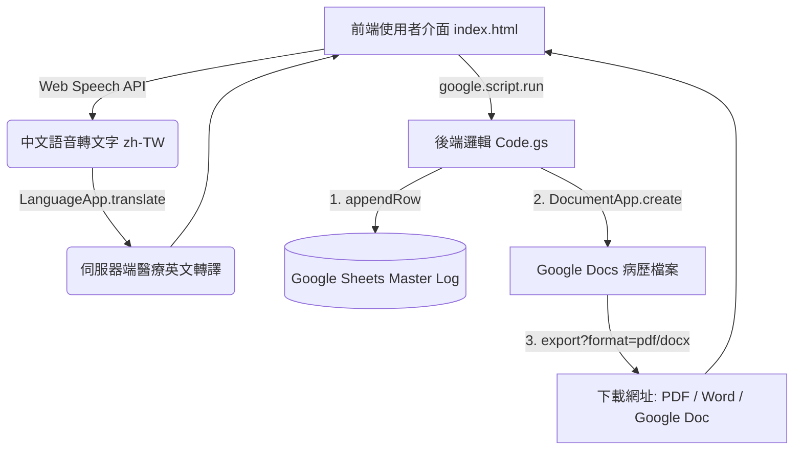

# 醫療用住院病歷 (Admission Note) 互動式網頁系統 - 設計文件

> **專案名稱**：2026 Google Spark - 醫療用住院病歷互動式 Web App  
> **使用對象**：朱國大醫師 (Dr. Kwo-Ta Chu, MD, PhD) 及臨床醫護人員  
> **核心技術**：Google Apps Script (GAS), Google Docs API, Google Sheets API, LanguageApp, Web Speech API, Vanilla JS, HTML5, Modern CSS (Glassmorphism)

---

## 1. 系統目標與概述

本專案旨在建置一套高效、直覺且合乎臨床規範的**醫療用住院病歷 (Admission Note) 互動式網頁應用程式**。
系統結合語音轉譯、結構化醫學選單、實時英文病歷組合以及 Google Spark (Apps Script) 後端雲端服務，達成以下核心目標：
1. **輸入便利性**：支援中文語音輸入轉英文文字 (Chinese Speech-to-Text + Machine Translation to English Medical Terms)。
2. **三核心病患資料處理**：
   - 病患基本資料 (General Data / Patient Demographics)
   - 主訴 (Chief Complaint, CC)
   - 最近症狀與現在病史 (History of Present Illness, HPI / Present Illness)
3. **完整住院病歷結構**：延伸支援過去病史 (PMH)、過敏史 (Allergies)、系統回顧 (ROS)、理學檢查 (Physical Exam)、初步診斷與處置計畫 (Assessment & Plan)。
4. **雲端跨平台導出**：自動歸檔至 Google Sheets 流水帳，並生成符合法規規範之 **Google Document**，同步提供 **Word 檔 (.docx)** 與 **PDF 檔 (.pdf)** 的直連下載。

---

## 2. 系統架構與模組劃分

系統採用 GAS 三層式 Web App 架構：

### (1) 前端 UI / UX 設計 (`index.html`)
- **雙模式選單 (Tab Navigation)**：
  - 📋 **住院病歷撰寫 (Admission Note)** (主要核心功能)
  - 🩺 **臨床檢查報告 (Clinical Examinations)** (整合既有心超、腹超、胃鏡、大腸鏡模組)
- **視覺美感 (Visual Aesthetics)**：深色/亮色醫療級 Modern Glassmorphism 微光玻璃風、Google Fonts (Inter / Noto Sans TC)、流暢響應式卡片 layout、即時微動畫。
- **語音轉譯模組 (Voice Input Component)**：
  - 語音按鈕 (🎙️ 點擊開始口述) 綁定 Web Speech API (`webkitSpeechRecognition`)。
  - 即時轉出中文草稿，並自動/一鍵呼叫後端 `LanguageApp.translate()` 轉為醫學英文。
- **結構化速填晶片 (Clinical Presets / Chips)**：點擊可快速插入常見主訴、常見慢性病史、系統回顧陽性發現。
- **實時病歷組合引擎 (Real-time Live Preview)**：隨編輯實時呈現符合國際標準的英文 Admission Note（包含 HPI LQQOPERA 邏輯結構化）。

### (2) 後端服務 (`Code.gs`)
- `doGet(e)`：渲染並輸出網頁 UI。
- `translateChineseToEnglish(text)`：調用 Google GAS 內建 `LanguageApp.translate(text, 'zh-TW', 'en')`，將中文輸入轉換為專業英文病歷描述。
- `saveAdmissionNoteRecord(record)`：
  1. 在 Google Sheets 寫入 `Master_AdmissionNotes` 頁籤。
  2. 於 Google Drive `住院病歷報告_GoogleDocs` 資料夾內建立正規格式的 Google Doc。
  3. 回傳 `docUrl`、`pdfUrl`、`docxUrl` 直連下載點。
- `getRecentAdmissionNotes(limit)` & `searchAdmissionNotes(query)`：歷史病歷查詢與檢索。

---

## 3. 資料欄位與範本規範

### (1) 住院病歷輸出範本格式 (Standard English Admission Note)
1. **General Data**: Patient Name, Chart No (MRN), Age/Gender, Admission Date, Ward/Bed, Attending Physician, Department.
2. **Chief Complaint (CC)**: Single or key symptoms with duration.
3. **History of Present Illness (HPI)**: Detailed chronological narrative, symptoms, aggravating/relieving factors, associated symptoms.
4. **Past Medical & Surgical History (PMH/PSH)**: Major comorbidities, prior operations, known drug allergies.
5. **Review of Systems (ROS) & Physical Examination (PE)**: Vital Signs (BP, HR, RR, Temp, SpO2), HEENT, Chest/Heart, Abdominal, Extremities, Neurologic.
6. **Impression / Assessment & Plan (A&P)**: Tentative Diagnosis, Problem list, diagnostic workups, therapeutic interventions.

---

## 4. 測試與驗證計畫
1. 前端語音辨識與翻譯測試（繁體中文語音輸入 -> 英文病歷文字）。
2. Google Sheets 寫入測試（核對欄位對齊與儲存完整性）。
3. Google Docs, Word (.docx), PDF (.pdf) 生成與下載網址有效性測試。
4. Chrome/Edge 相容性與響應式螢幕調適。
